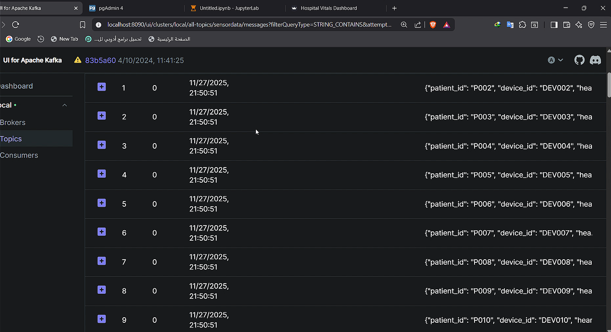
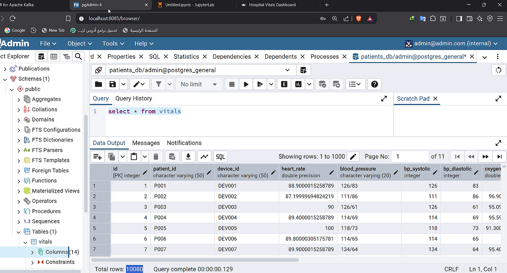
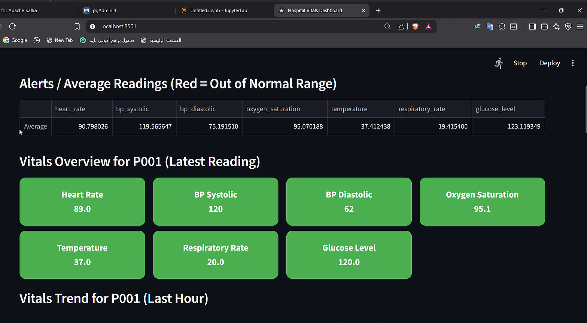
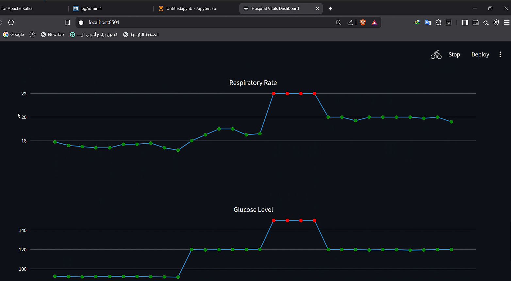

<h1 align="center">🏥 IoT Healthcare Data Pipeline</h1>

<p align="center">
  <strong>A Real-Time IoT Medical Monitoring & Data Engineering Pipeline</strong>
</p>

<p align="center">
  
  
  
  
  
</p>

---

## 🔍 Overview  
This project delivers a complete real-time IoT healthcare monitoring pipeline capable of simulating patient vital signs, streaming them through Kafka, processing anomalies with Spark Streaming, storing structured data in PostgreSQL, and visualizing everything live using a Streamlit dashboard.

It is a **full, scalable, fault-tolerant data engineering system** suitable for medical research, education, and real-world prototyping.

---

## 🎥 Demo Video  
👉 **[Click to Watch the Demo](https://drive.google.com/file/d/1ERCLwLHwSd4mKA6Pgb2VXUpPFr3wXkuY/view?usp=sharing)**

---

## 🖼 System Screenshots  

| Description | Screenshot |
|------------|------------|
| **Kafka Live Stream** |  |
| **PostgreSQL Database** |  |
| **Streamlit Dashboard – Main View** |  |
| **Streamlit Dashboard – Alerts View** |  |

---

## 🚀 Features  
✔ Real-time IoT vitals simulation  
✔ High-throughput Kafka streaming  
✔ Spark Structured Streaming anomaly detection  
✔ PostgreSQL for long-term time-series storage  
✔ Live dashboard for vitals, alerts, and summaries  
✔ Modular, scalable, fault-tolerant architecture  
✔ Fully documented and ready for real deployment  

---


## 🧰 Technologies Used  

| Layer | Technology |
|-------|------------|
| Data Simulation | Python |
| Streaming Pipeline | Apache Kafka |
| Real-Time Analytics | Apache Spark (Structured Streaming) |
| Storage | PostgreSQL |
| Dashboard | Streamlit |

---


## 📊 Database Schema (Simplified)  
```
Doctors (1) ───< Patients (∞)
Patients (1) ───< Vitals (∞)
Patients (1) ───< Alerts_Log (∞)
Devices (1) ───< Vitals (∞)
```

---

## 🔮 Future Enhancements  
- Add real IoT medical devices
- Cloud deployment (AWS – GCP – Azure)
- ML-powered anomaly detection  
- Predictive analytics & early warning system  

---

## 👥 Team  
- Rawda Abokhalil
- Rahma AbdElaleim
- Youssef Ahmed  
- Ahmed Youssef  
- **Belal Ahmed**  
**Supervisor:** Eng. Mohamed Hamed

---

## 📬 Contact  
📧 be1a1a7med22@gmail.com
